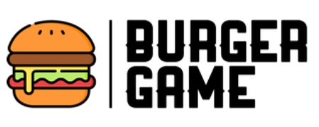

# 🍟🍔 Burger Game - Back-end - API

    

## Índice

* [1. Prefácio](#1-prefácio)
* [2. Resumo do projeto](#2-resumo-do-projeto)
* [3. Endpoints da API](#3-endpoints-da-api)
* [4. Implementações](#4-implementações)
* [5. Desenvolvedora](#5-desenvolvedora)

## 1. Prefácio

O restaurante Burger Game , que está crescendo, necessita de um
sistema para realizar pedidos usando um _tablet_, e que os enviem à
cozinha para que sejam preparados de forma ordenada e eficiente.

A interface front-end da aplicação Burger Queen já foi criado [acesse aqui](https://burger-game.netlify.app/) para conhecer.
Com a criação do back-end, temos a facilidade de realizar o manejamento dos dados. Realizado através
de uma _API rest_ que e compatível com as requisições vindas do front.

## 2. Resumo do projeto

Como back-end, nesse caso nos referimos a um _servidor web_, que é basicamente
um programa que _ouve_ o que acontece na aplicação através de uma porta de rede,
pela qual podemos enviar _requisições_ (_requests_) e obter _respostas_ (_responses_).

Um servidor web deve _manejar_ as requisições que chegam e devolver respostas a elas,
que serão enviadas de volta ao _cliente_. Quando falamos de _aplicações de servidor_,
isso implica uma arquitetura de _cliente/servidor_, onde o cliente é um programa
que faz requisições através de uma rede (por exemplo o navegador, o cURL, etc)
e o servidor é o programa que recebe essas requisições e as responde.
## 3. Endpoints da API 
#### `/users`

* `GET /users`
* `GET /users/:uid`
* `POST /users`
* `PUT /users/:uid`
* `DELETE /users/:uid`
#### `/products`

* `GET /products`
* `GET /products/:productid`
* `POST /products`
* `PUT /products/:productid`
* `DELETE /products/:productid`
#### `/orders`

* `GET /orders`
* `GET /orders/:orderId`
* `POST /orders`
* `PUT /orders/:orderId`
* `DELETE /orders/:orderId`

## 4. Implementações
Como implentação futura, pretendo realizar o desenvolvimento: 
* Middleware de erros
* Outros endpoints
* Criar a documentação da API
* Testes unitários para cada função
* Testes _"end to end"_ ou _e2e_ (de uma ponta a outra)

## 5. Desenvolvedora

Este projeto foi desenvolvido * [Luciana Pereira ](https://github.com/luciana-pereira).
